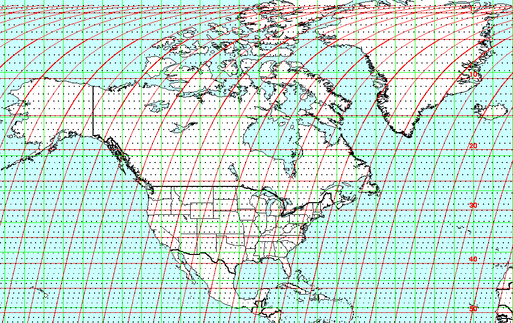

```{r echo=FALSE}
yml_content <- yaml::read_yaml("chapterauthors.yml")
author <- yml_content[["lab4shortname"]][["author"]]
```
# Introduction to Landsat Image Processing {#image-process}

Written by
```{r results='asis', echo=FALSE}
cat(author)
```

## Lab Overview {-}

The Landsat satellite program has been active since 1972 and represents one of the most valuable remote sensing datsets in environmental monitoring and ecology.  The Landsat series of satellites measure passive reflectance from the Earth's surface and atmosphere and is used in the fields of agcriculture, forestry, geology and hydrology. In 2008, all Landsat data was made open to the public and this has triggered widespread uptake by governments and research groups across the world.

In this lab, you will work with images collected by the Landsat 8 to understand radiometric resolution and get a chance to practice  image processing steps including masking clouds and cloud shadows and applying image enhancements.

``` {r, echo=FALSE, fig.align = 'center'}
knitr::include_graphics('images/01/01-lsat.jpg')
```

------------------------------------------------------------------------

## Learning Objectives {-}

-   Understand radiometric resolution and how it relates to Digital Numbers
-   Learn how to resample rasters to common projections 
-   Use the Landsat Quality Assurance Band to mask clouds and shadows
-   Understand how image enhancements and focal filters work

------------------------------------------------------------------------

## Deliverables {-}

-   Screenshots of historgrams and filtered images
-   Answers to 9 questions posed in the handout

------------------------------------------------------------------------

## Data {-}

- Two Landsat 8 Surface Reflectance images

------------------------------------------------------------------------

## Task 1: Data Types & Projections {.unnumbered}

You are given two Landsat Surface Reflectance images.

- **LC08_047026_20200830_02_T1_a.tif**
- **LC08_047026_20200830_02_T1_b.tif**

The filenames use the following naming pattern that tells you information about the data product and when the image was acquired: LXSS_PPPRRR_YYYYMMDD_CC_TX.tif

- L = Landsat
- X = OLI/TIRS Sensor
- S = Landsat 8 satellite
- PPP = WRS path
- RRR = WRS row
- YYYYMMDD = Acquistion year, month, day
- CC = Collection number
- TX = Collection Category

WRS path/row refer to a worldwide grid system, where each Landsat scene is assigned a specific path (longitude) and row (latitude) coordinate. 

``` {r, echo=FALSE, out.width = "75%", fig.align = 'center'}

```

Use the USGS resource to answer the following questions: 'https://www.usgs.gov/faqs/what-naming-convention-landsat-collections-level-1-scenes'

##### Q1: For the Landsat scenes you are given, what Landsat sensor and satellite do the images come from? When were the images acuqired and what Landsat Collection number are they found in? {.unnumbered} 

##### Q2: Data in Landsat Collections 1 & 2 have been pre-processed so that images across time are geometrically and radiometicrally consistent. In 2-4 sentences explain what this means and why it is important for detecting environmental changes. {.unnumbered}

##### Q3: The following image shows the spectral profile of a vegetated surface before and after atmospheric correction. Describe the differences between the two profiles and explain the properties of the atmosphere that causes this. In your own words, why is it important to correct for atmospheric effects when using satellite imagery collectd at different times? {.unnumbered}

``` {r, echo=FALSE, out.width = "50%", fig.align = 'center'}
knitr::include_graphics('images/01/01-nocorr.jpg')
```


``` {r, echo=FALSE, out.width = "50%", fig.align = 'center'}
knitr::include_graphics('images/01/01-corr.jpg')
```

**Step 1:** Import the following rasters **LC08_047026_20200830_SR_A.tif** and **LC08_047026_20200830_SR_B.tif** into a new Map Project in ArcGIS Pro. Name the project Lab 1 and save it in the default documents folder on your computer, typically `C:\Users\YourUsername\Documents\ArcGIS\Projects\Lab2.` 

The bands are as follows: 

- SR_B2 = Blue
- SR_B3 = Green
- SR_B4 = Red
- SR_B5 = NIR
- SR_B6 = SWIR1

Experiment with the **Symbology** tab and include screenshots of the following band combinations for raster A in your final deliverables: 

- RGB true-color
- False color infrared, with NIR in the red channel

Navigate to > Properties > General and use the image metadata to answer the following questions about the Surface Reflectance rasters.

``` {r, echo=FALSE, out.width = "75%", fig.align = 'center'}
knitr::include_graphics('images/01/01-arc.jpg')
```

##### Q4: What are the projections of raster A and raster B? What are the data types (i.e. integer or floating point)? {.unnumbered}

##### Q5: Define **radiometric resolution** and describe how it relates to the range of possible values in the image. {.unnumbered}

##### Q6: How many possible values would be present in an 8-bit, 16-bit and 32-bit image? What are the bit-types of rasters A and B (HINT: look at the min/max values of the rasters)? {.unnumbered}

Zoom in so you can see individual pixels and notice how the different raster projections change how the pixels align. Raster A is in the correct UTM Zone projection, while raster B is not. 

##### Q7: Imagine you want to see how the reflectance of a small forest stand changes over time. Why would it be important that your imagery is displayed in the same projection?  {.unnumbered}

**Step 2:** Convert raster B to the **NAD 1983 UTM Zone 10** projection using the **Project Raster** tool and save the result as a new raster. 

``` {r, echo=FALSE, out.width = "40%", fig.align = 'center'}
knitr::include_graphics('images/01/01-proj.jpg')
```

**Include a screenshot of the Spatial Reference information (in the General tab) for the new raster in your final deliverables**

##### Q8: Which resampling method (Nearest Neighbour or Bilinear Interpolation) is most appropriate for continuous data (i.e. temperature, elevation) and why? What about discrete data (i.e. land cover classes, cateogries)? {.unnumbered}

------------------------------------------------------------------------

## Task 2: Cloud and Shadow Masking {.unnumbered}

Next, we will use the Quality Assurance (QA) band to mask out pixels covered by clouds and cloud shadows.

Landsat (and many other types of remote sensing imagery) use a **Bitmask** to store information related to the quality of a pixel. For each pixel, a bitmask is simply a series of classifications for whether the pixel contains clouds, snow, shadows, haze, and other atmospheric artefacts we want to remove. Bitmasks also contain information on the level of confidence in the pixel classification. All this information is stored in an integer that can be transformed into it's binary counterpart composed of 0's and 1's. Using a bitmask reduces the filesize of a raster, as the integer values are shorter than their binary conunterparts.       

The Landsat QA_BAND is a 15-bit integer, meaning that the pixel values can range from 0 to 2^15. There are 15 different indicators stored in this band that relate to pixel quality (clouds, haze etc...). The full list can be found here (expand the bitmask for QA_PIXEL section): https://developers.google.com/earth-engine/datasets/catalog/LANDSAT_LC08_C02_T1_TOA#bands 

``` {r, echo=FALSE, out.width = "40%", fig.align = 'center'}
knitr::include_graphics('images/01/01-qabits.jpg')
```

To interpret the pixel value of a bitmask first convert the integer to binary: 

For example: `22280` becomes `101011100001000`

Starting from the right, each value is assigned a **Bit Position** starting at 0 and counting up to the total number of values. 

If we want to know if a pixel is cloudy we need to look at bit 3. In this example, bit 3 is represented by the **fourth number from the right**, and has a value of **1**. 

``` {r, echo=FALSE, fig.align = 'center'}
knitr::include_graphics('images/01/01-bit3.jpg')
```

According to the bitmask, a value of `1` in bit position 3 indicates a pixel with high confidence cloud.

You will notice that some of the indicators are represented by multiple bit positions. For example, bits 8-9 encode the degree of confidence in the cloud classification. 

``` {r, echo=FALSE, fig.align = 'center'}
knitr::include_graphics('images/01/01-bit89.jpg')
```

For our pixel example, bit positions 8-9 contain the values `10`, converting this binary number back to integer gives the value `2`, which corresponds to Medium confidence. 

Use the following online tool to convert between integer and binary numbers and answer the following question: https://www.rapidtables.com/convert/number/binary-to-decimal.html

##### Q9: For a pixel with the integer value 23888, what is the classification for Bit 3:Cloud and Bit 4: Cloud Shadow? What about Bit 10-11: Cloud Shadow Confidence? 

**Step 1:**

##### Q6: If you didn't have the QA band, what Landsat bands/spectral properties could you use to idenify cloudy pixels? {.unnumbered}

------------------------------------------------------------------------

## Task 3: Image Enhancement and Focal Filters {.unnumbered}

**Step 1:** View the NIR band of the cloud masked image in greyscale. Create a histogram of surface reflectance values and include in the deliverables. 

##### Q6: What do the light and dark areas of the image represent in terms of surface reflectance? How could you use this image to identify vegetation and urban areas? {.unnumbered} 

##### Q7: What is a histogram in the context of a remote sensing image? What do the X and Y axes represent? {.unnumbered}

**Step 2:** Create a histogram of NIR surface reflectance. Apply a **Minimum-Maximum Strech** and a **Standard Deviation Strech with n = 2.5**, and notice how the image appearance and the histogram change. 

##### Q8: Describe how the distribution of values in the histogram changes with both image enhancements. What parts of the image have greater contrast? How could this help you interpret the image? {.unnumbered} 

**Step 3:** Apply a **Sharpening** and **Smoothing** filter to the cloud masked image. Take a screenshot of the filtered images and present them side-by-side in your deliverables. 

##### Q10: Define a **focal window** and describe how a filter changes the pixel values of an image usig the focal window. Use the following matrix to calculate the new pixel value labelled with a * using a **3x3 mean filter** {.unnumbered} 

```{r echo = F, results = 'asis'}
    
values = c(1, 3, 9, 11, 5, 8, 6, "5*", 11, 5, 9, 10)
    m = matrix(values, nrow = 3)
    
  # Utility function to print matrices in proper LaTeX format
print_mat <- function(mat) {
  n <- nrow(mat)
  c('\\begin{bmatrix}',
    paste0(sapply(seq_len(n - 1),
                  function(i) paste0(mat[i, ], collapse = ' & ')),
           ' \\\\'),
    paste0(mat[n, ], collapse = ' & '),
    '\\end{bmatrix}')
} 

writeLines(print_mat(m))

```

##### Q9: Define **spatial frequency** and describe how the sharpened and smoothed images differ in terms of their spatial frequencies. What are some advantages and disadvantages of these focal filters? {.unnumbered} 


