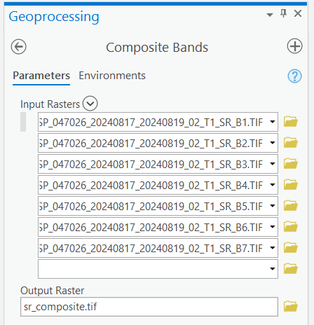
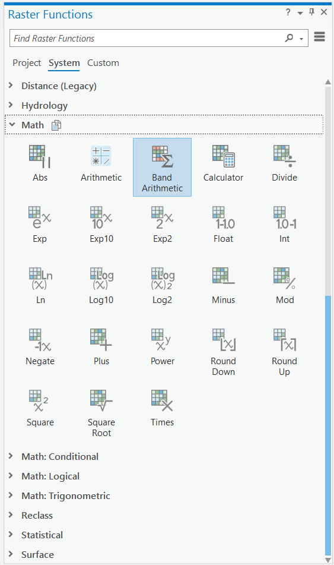
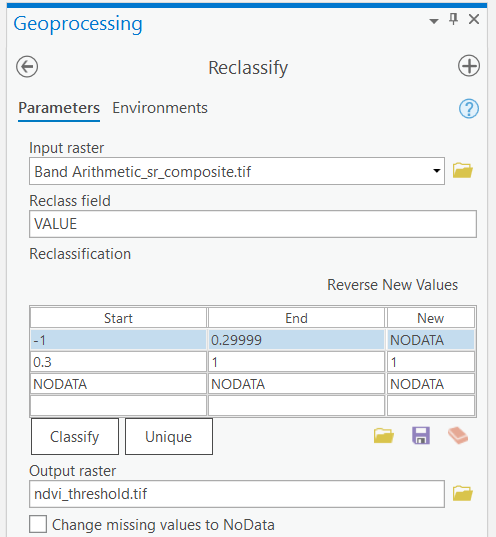
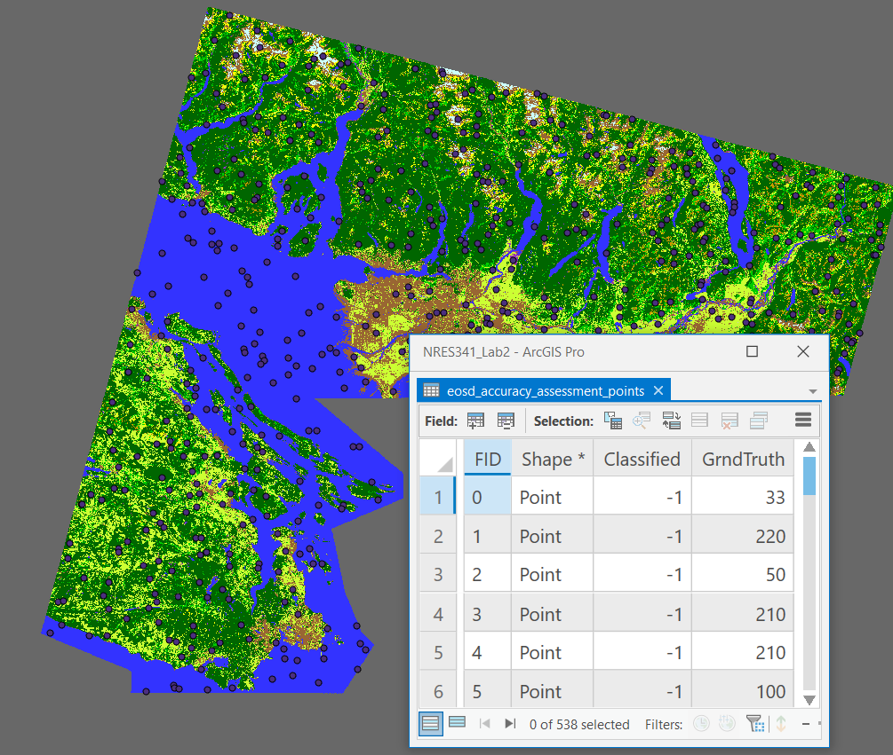

```{r echo=FALSE}
yml_content <- yaml::read_yaml("chapterauthors.yml")
author <- yml_content[["landsat-image-classification"]][["author"]]
```

# Landsat Image Classification in ArcGIS Pro {#landsat-image-classification}

Written by

```{r results='asis', echo=FALSE}
cat(author)
```

## Lab Overview {.unnumbered}

Image classification is a common task in image analysis. Land cover classification maps can be useful for calculating the total area of different classes and other spatial information about a land base. In this lab, we will explore simple methods that involve thresholding a spectral index and more complex unsupervised and supervised algorithms. At the end, you will be asked to reflect on the choices and assumptions that were made and what impact those have on the final classification and how we can use it.

------------------------------------------------------------------------

## Learning Objectives {.unnumbered}

-   Calculate a simple spectral index
-   Apply supervised and unsupervised classification algorithms to create a land cover map
-   Interpet a confusion matrix

------------------------------------------------------------------------

## Deliverables {.unnumbered}

-   Answers to questions posed throughout the lab handout
-   Screenshot of NDVI image
-   Screenshot of ISO cluster map
-   Screenshot of confusion matrix
-   Map of supervised EOSD land cover classification

------------------------------------------------------------------------

## Data {.unnumbered}

We will be using a Landsat 9 Operational Land Imager 2 (OLI-2) multispectral image and a number of quality assurance (QA) bands and other metadata that are distributed with this product. You can download these data from Canvas.

------------------------------------------------------------------------

## Task 1: Prepare data for analysis {.unnumbered}

**Step 1:** Open ArcGIS Pro and create a new project. Download the lab data from Canvas and extract those data into your ArcGIS Pro project folder that you just created, usually in "C:\Users\you\Documents\ArcGIS\Projects\lab2".

**Step 2:** Search for the "Compsite Bands" tool in ArcGIS Pro. Add all of the seven surface reflectance bands and then name the output "sr_composite.tif" and save it in your ArcGIS Pro project folder.

```{r 02-arcgispro-composite-bands, out.width= "40%", echo = FALSE}
    
```

**Step 3:** Right-click the **sr_composite.tif** layer and open the symbology. Create a 6-5-4 false colour image.

```{r 02-arcgispro-654, out.width= "75%", echo = FALSE}
    knitr::include_graphics("images/02/02-arcgispro-654.png")
```

Next, we will calculate some spectral indices from this composite image. Spectral indices are mathematical equations containing spectral reflectance values from two or more wavelengths used to highlight areas of spectral importance in an image. There are a wide variety of spectral indices used to highlight a variety of different land covers and image properties. The Normalized Difference Vegetation Index (NDVI) is a frequently used spectral index that takes advantage of the high near-infrared reflectance and high red absorption properties of healthy vegetation and is therefore often used to quantify vegetation in a remotely sensed multispectral image.

NDVI is calculated with the below formula:

$\ NDVI = \frac{(NIR - RED)}{(NIR+RED)}$

Where NIR is the near-infrared band (Landsat 9 Band 5) and Red is the red band (Landsat 9 Band 4). The results of this equation should be an index with values ranging between -1 and 1. Values less than 0 represent water (i.e., a higher absorption of NIR compared to Red) and values between 0-1 representing different levels of green vegetation.

ArcGIS Pro contains several ways to calculate common indices like NDVI. In this lab we will be using the "band arithmetic" function as it is a bit more flexible and easier to understand.

**Step 4:** Navigate to the Imagery tab on the ribbon at the top of your ArcGIS Pro window and click the "Raster Function" button. The Raster Functions pane should appear, you can either navigate the drop down menus to "Math" \> "Band Arithmetic" or use the search function to find the "Band Arithmetic Tool" and click to open.

```{r 02-arcgispro-band-arithmetic, out.width= "40%", echo = FALSE}
    
```

The "Band Arithmetic Properties" dialogue should appear. Under "Raster" use the drop down menu and select the **sr_composite.tif** layer. If it is not currently in your map view and can use the folder button and navigate to your lab data folder and select the file. Under "Method" select "User Defined".

Using your knowledge of spectral indices, fill in the NDVI calculation for your data.

##### Screenshot 1: Upload a screenshot of your NDVI image. {.unnumbered}

##### Q1. What are the minimum and maximum values of your new NDVI layer? {.unnumbered}

##### Q2. What do the dark areas in the image represent? The gray areas? The white? {.unnumbered}

##### Q3. What information does this type of analysis give us? When and why might this type of analysis be used? {.unnumbered}

Next, we will use a technique called thresholding to extract highly vegetated areas (high NDVI).

**Step 5:** Under the "Analysis" ribbon select the "Tools" option. The geoprocessing window should appear in the search box type "Reclassify" and select the option with "(Spatial Analyst Tools)" beside it.

```{r 02-arcgispro-reclassify, out.width= "75%", echo = FALSE}
    knitr::include_graphics("images/02/02-arcgispro-reclassify.png")
```

**Step 6:** Select the NDVI band arithmetic raster layer that you produced from Task 1. Reclassify the NDVI values so that values greater than or equal to 0.3 have a new value of 1 and all others have a value of NODATA. Under "Output Raster" save the file as "ndvi_threshold.tif" and run the tool.

```{r 02-arcgispro-reclassify-ndvi, out.width= "75%", echo = FALSE}
    
```

------------------------------------------------------------------------

## Task 2: Unsupervised Image Classification {.unnumbered}

**Step 1:** Left-click on the **sr_composite.tif** layer in your Contents pane to select it.

**Step 2:** From the top ribbon, select "Imagery", then click the "Classification Tools" button and finally select "Classify".

```{r 02-arcgispro-classify, out.width= "75%", echo = FALSE}
    knitr::include_graphics("images/02/02-arcgispro-classify.png")
```

**Step 3:** At the top of the tool, select "ISO Cluster" from the "Classifer drop-down menu. Set"Maximum Number of Classes" to 10. Change the "Output Classified Dataset" name to "iso_cluster.tif" and run the tool.

**Step 4:** Inspect the output. You may want to open the layer Symbology and change the color scheme to a random set of colours. From the Symbology pane, you can change the "Label" of each class value to anything your want by double-clicking the cell and typing any text. Spend some time interpreting the unsupervised classes and providing appropriate labels for each. You may want to toggle between the ISO cluster classification and the 6-5-4 false colour image to aid your interpretations.

```{r 02-arcgispro-iso-cluster, out.width= "75%", echo = FALSE}
    knitr::include_graphics("images/02/02-arcgispro-iso-cluster.png")
```

##### Screenshot 2: Upload a screenshot of your ISO cluster map result with your labelled legend visible in the Contents pane. {.unnumbered}

------------------------------------------------------------------------

## Task 3: Supervised Image Classification {.unnumbered}

**Step 1:** Left-click on the **sr_composite.tif** layer in your Contents pane to select it.

**Step 2:** From the top ribbon, select "Imagery", then click the "Classification Tools" button and finally select "Training Samples Manager".

```{r 02-arcgispro-training-samples-manager, out.width= "75%", echo = FALSE}
    knitr::include_graphics("images/02/02-arcgispro-training-samples-manager.png")
```

In the tool, you should see the "NLCD2011" classification scheme pre-loaded at the top and it contains some generic classes. If you do not, you can load it by clicking the folder icon and then selecting "Use default schema". NLCD stands for National Land Cover Database and 2011 is the nominal year that this schema was produced for. "National" in this case refers to the United States, not Canada. This is a land cover schema you would typically find for the United States. Canada has a similar land cover dataset called Earth Observation for Sustainable Development of Forests (EOSD). We are going to create a new schema that uses the Canadian labels from the EOSD legend.

```{r 02-arcgispro-nlcd2011, out.width= "40%", echo = FALSE}
    knitr::include_graphics("images/02/02-arcgispro-nlcd2011.png")
```

**Step 3:** Click the button to the left of the folder icon to "Create New Schema". This will get rid of the NLCD2011 schema that was loaded and allow you to start populating the class values. To add a new class value, click the green plus mark + and then type the name of the class and then the value of that class to be encoded in the raster. If you want, you can pick colours for your classes at this stage or just accept the default. Using this process, enter the classes in the following table as your new schema:

| Class Name          | Value |
|---------------------|-------|
| Water               | 20    |
| Snow/Ice            | 31    |
| Rock/Rubble         | 32    |
| Exposed/Barren Land | 33    |
| Shrubs              | 50    |
| Wetland             | 80    |
| Wetland-Treed       | 81    |
| Herbs               | 100   |
| Coniferous Forest   | 210   |
| Broadleaf           | 220   |
| Mixedwood           | 230   |

Your final schema should look like the image below. You might want to save your schema now in case you need to stop the lab and finish later.

```{r 02-arcgispro-eosd, out.width= "40%", echo = FALSE}
    knitr::include_graphics("images/02/02-arcgispro-eosd.png")
```

**Step 4:** Left-click on any class in the schema in order to make the digitizing tools available at the top. Once a class is selected, you can choose to digitize a training sample for that class using a rectangle, polygon, circle or free-hand by selecting one of those tools at the top. Then, you can digitize directly onto the map. You will want to have the 6-5-4 false colour image displayed and you will want to digitize training samples that are relatively small and homogenous, so be careful with how you draw your lines. Repeat this process until you have about 5-8 training samples per class. This will take a great deal of interpretation and you may not be able to distinguish between "Wetland" and "Wetland-Treed", but do your best. If you cannot find any samples for a class, skip it. Feel free to consult other information to help you create the training samples. When you are finished creating training samples, save them into your project geodatabase as "EOSD_training_samples".

```{r 02-arcgispro-digitize-trainging-samples, out.width= "40%", echo = FALSE}
    knitr::include_graphics("images/02/02-arcgispro-digitize-trainging-samples.png")
```

**Step 5:** Left-click on the **sr_composite.tif** layer in the Contents pane and then from the ribbon select "Imagery", "Classification Tools", and "Classify". Change the "Classifier" to "Maximum Likelihood" and navigate to the "EOSD_training_samples" that you saved in your geodatabase for the Training Samples. Save the "Output Classified Dataset" as "EOSD_Classified", then run the tool.

```{r 02-arcgispo-create-accuracy-assessment-points, out.width= "75%", echo = FALSE}
    knitr::include_graphics("images/02/02-arcgispro-create-accuracy-assessment-points.png")
```

**Step 6:** From the Geoprocessing pane, search for the "Create Accuracy Assessment Points" tool. Add the **CA_forest_VLCE2_2022_clip.tif** as the Input Raster (this is the classified EOSD land cover). Save the Output Accuracy Assessment Points as "eosd_accuracy_assessment_points" in your project geodatabase. Change the Target Filed to "Ground Truth", leave the other parameters as default and then run the tool. This will generate 500 points randomly stratified across the classes in the official EOSD land cover classification. Open the attribute table to inspect the output.

```{r 02-arcgispro-accuracy-assessment-points-attributes, out.width= "75%", echo = FALSE}
    
```

**Step 7:** From the Geoprocessing pane, search for the "Update Accuracy Assessment Points" tool. This time, we are going to select our "EOSD_Classified" image that we classified earlier as the Input Raster. The Input and Output Accuracy Assessment Points can be the same points that you created in the last step. Change the "Target Field" to "Classified" and then run the tool.

```{r 02-arcgispro-update-accuracy-assessment-points, out.width= "40%", echo = FALSE}
    knitr::include_graphics("images/02/02-arcgispro-update-accuracy-assessment-points.png")
```

**Step 8:** From the Geoprocessing pane, search for the "Compute Confusion Matrix" tool. Use the "eosd_accuracy_assessment_points" as the Input Accuracy Assessment Points and save the output as "confusion_matrix" in your geodatabase then run the tool.

```{r 02-arcgispro-confusion-matrix, out.width= "40%", echo = FALSE}
    knitr::include_graphics("images/02/02-arcgispro-confusion-matrix.png")
```

##### Screenshot 3: Upload a screenshot of your confusion matrix. {.unnumbered}

##### Q4. Which of your classes had the highest User's accuracy? Why? {.unnumbered}

##### Q5. Which of your classes had the lowest User's accuracy? Why? {.unnumbered}

##### Q6. Which of your classes had the highest Producer's accuracy? Why? {.unnumbered}

##### Q7. Which of your classes had the lowest Producer's accuracy? Why? {.unnumbered}

##### Q8. Compare and contrast your unsupervised classification with your supervised classification. How did these methods compare with the very simple thresholding approach you did earlier with NDVI? {.unnumbered}

##### Q9. How did the thematic resolution of the EOSD classification impact your ability to discern classes in an urban environment? If you had to do this again, are there any classes that you would drop, combine, or introduce? {.unnumbered}

Export a professional map of your final supervised EOSD classification and upload to Canvas. 